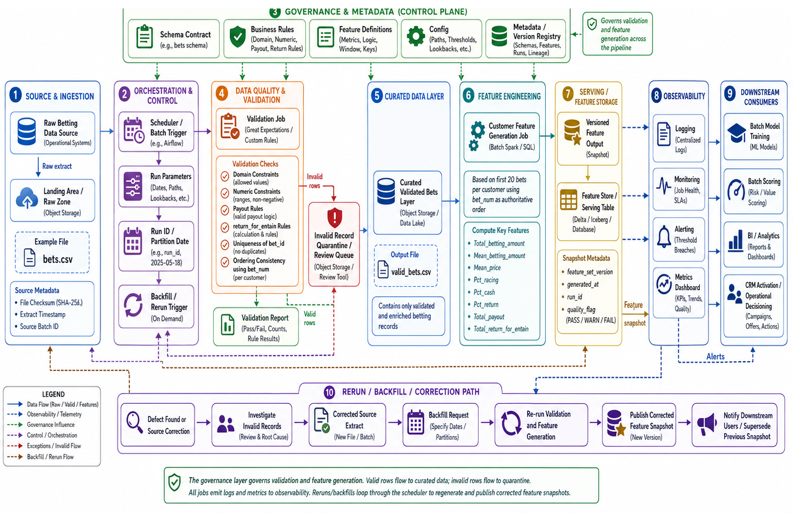
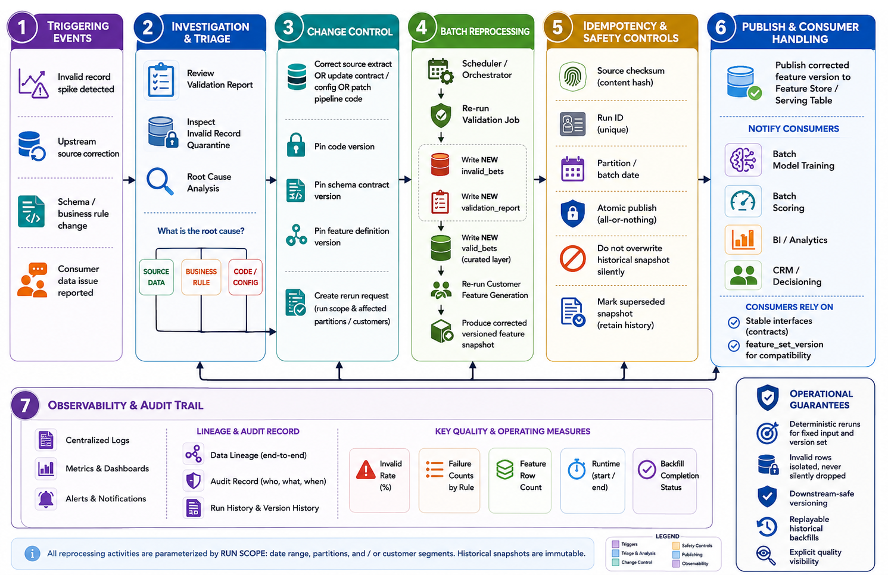

 # Entain Betting ML Batch Pipeline

 ## Executive Summary

 This repository packages a production-minded, Python-based batch workflow that takes a raw betting extract, validates every row against the documented schema, quarantines failures with deterministic explanations, and materializes customer-level ML features derived from each player’s first 20 bets. It is sized for local reproducibility while following the same contracts, observability, and operational discipline required in enterprise data products. Training, APIs, and hosted services lie outside this scope; this stack exists upstream of scoring, analytics, CRM activation, and downstream decisioning.

 ## Architectural Highlights

 The pipeline is intentionally boundary-driven. Each stage emits explicit inputs, outputs, and metadata so downstream teams can build trust:

 | Boundary | Responsibility | Outputs |
 | --- | --- | --- |
 | **Raw** | `data/bets.csv` is read as strings to prevent pandas type coercion from masking issues. | Raw strings |
 | **Validation** | `bet-pipeline validate` enforces the schema, numeric rules, sequences, uniqueness, and monetary policies. | `valid_bets.csv`, `invalid_bets.csv`, `validation_report.json` |
 | **Feature Generation** | `bet-pipeline build-features` filters to the first 20 valid bets per customer, computes feature definitions, and annotates quality. | `customer_features.{csv,parquet}`, `feature_build_report.json` |
 | **Consumption** | Generated features can be consumed as CSV/Parquet locally or exported to a feature store in production. | Versioned customer feature table |

 

 The rerun and correction flow is separated for clarity.

 

 Reference artifacts:

 - [Architecture explanation](architecture_diagram/architecture.md)
 - [Batch ML architecture PNG](architecture_diagram/batch_ml_architecture.png)
 - [Backfill/data-quality flow PNG](architecture_diagram/backfill_data_quality_flow.png)

 ## Project Materials

 ```text
 .
 ├── architecture_diagram/
 │   ├── architecture.md                   # Architecture explanation and operating model
 │   ├── batch_ml_architecture.png         # Main ML system architecture diagram
 │   └── backfill_data_quality_flow.png    # Rerun, correction, and backfill path
 ├── customer_feature_output/
 │   ├── customer_features.csv             # Customer-level first-20 feature table
 │   ├── customer_features.parquet         # Typed feature output when pyarrow is installed
 │   └── feature_build_report.json         # Feature run summary and validation summary
 ├── data/
 │   └── bets.csv                          # Raw betting extract used for the submitted run
 ├── design_note/
 │   ├── ai_assistance_note.md             # Transparent note on selective AI-assisted review
 │   ├── architecture_design_note.md       # Architecture reasoning and production fit
 │   ├── feature_design_note.md            # Feature-window and aggregation decisions
 │   ├── system_design_note.md             # Full system design narrative
 │   └── validation_design_note.md         # Validation and quarantine decisions
 ├── docs/
 │   ├── data_contract.md                  # Input, quarantine, and feature contracts
 │   ├── jr-mle-task.docx                  # Original task brief
 │   ├── operations_runbook.md             # Operating, review, rerun, and alert guidance
 │   ├── task_breakdown.md                 # Requirement-to-deliverable mapping
 │   └── testing_strategy.md               # Test coverage and validation approach
 ├── source_code/src/bet_pipeline/
 │   ├── __init__.py
 │   ├── build_features.py                 # Customer feature generation workflow
 │   ├── cli.py                            # `bet-pipeline` command-line interface
 │   ├── config/
 │   │   ├── feature_definitions.json      # Machine-readable feature definitions
 │   │   └── schema_contract.json          # Machine-readable schema/business contract
 │   ├── constants.py                      # Shared rule constants
 │   ├── io.py                             # Repeatable local I/O helpers
 │   └── validate.py                       # Validation, quarantine, and report workflow
 ├── tests/
 │   ├── test_cli.py                       # CLI output tests
 │   ├── test_features.py                  # Feature logic tests
 │   └── test_validation.py                # Validation rule tests
 ├── Dockerfile                            # Clean-environment runtime image
 ├── Makefile                              # Convenience commands
 ├── pyproject.toml                        # Packaging, dependencies, pytest config
 └── README.md
 ```

 Key supporting documents:

 - [Data contract](docs/data_contract.md)
 - [Operations runbook](docs/operations_runbook.md)
 - [Testing strategy](docs/testing_strategy.md)
 - [Task breakdown](docs/task_breakdown.md)
 - [System design note](design_note/system_design_note.md)
 - [Validation design note](design_note/validation_design_note.md)
 - [Feature design note](design_note/feature_design_note.md)
 - [Architecture design note](design_note/architecture_design_note.md)
 - [Selective AI assistance note](design_note/ai_assistance_note.md)

 ## Getting Started

 ### Environment

 Supported interpreter: Python 3.10+ (3.11 on macOS/package builder). Install dependencies and enter the virtual environment:

 ```bash
 python -m venv .venv
 source .venv/bin/activate
 python -m pip install --upgrade pip
 python -m pip install -e ".[dev,parquet]"
 ```

 - `.[dev,parquet]` includes dev dependencies plus `pyarrow` for Parquet serialization.
 - `requirements.lock` preserves the dependency set used for the verified run.
 - For a one-command bootstrap, run `make setup`.

 ### High-level commands

 ```bash
 bet-pipeline validate --input data/bets.csv --output validation_outputs
 bet-pipeline build-features --input data/bets.csv --output customer_feature_output
 ```

 Use `PYTHONPATH=source_code/src python -m bet_pipeline.cli ...` when the console entry point is not installed.

 ## Validation Workflow

 Validation enforces schema, cardinality, monetary precision, and ordering before any feature work happens.

 Inputs: `data/bets.csv` (string-typed).

 Outputs:

 - `validation_outputs/valid_bets.csv`
 - `validation_outputs/invalid_bets.csv`
 - `validation_outputs/validation_report.json`

 Steps:

 1. Check for required columns; extra columns are reported but do not fail the run.
 2. Validate datatypes: integers for `bet_id`/`bet_num`, UUID `customer_id`, ISO datetime `bet_datetime`.
 3. Ensure numeric and business constraints:
    - positive `bet_num` and `betting_amount`
    - `price > 1`
    - allowed `category`, `stake_type`, `bet_result`
    - numeric `payout` and `return_for_entain`
    - payout and return rules per business policy
 4. Enforce uniqueness (`bet_id` and `(customer_id, bet_num)`).
 5. Confirm non-decreasing `bet_datetime` within each customer sequence.

 Each failure is persisted with the rule in `validation_report.json`. Reproducible runs can pin metadata via `--generated-at` and `--run-id`.

 ## Feature Generation

 Feature generation consumes the validated file, filters to the first 20 valid bets per customer, and emits deterministic, signed-off features.

 Outputs:

 - `customer_feature_output/customer_features.csv`
 - `customer_feature_output/customer_features.parquet` (when `pyarrow` is present)
 - `customer_feature_output/feature_build_report.json`

 Features span behavioral, financial, and quality dimensions:

 Required columns:

 - `customer_id`
 - `first_bet_datetime`
 - `twentieth_bet_datetime`
 - `bets_used`
 - `total_betting_amount`
 - `mean_betting_amount`
 - `mean_price`
 - `pct_racing`
 - `pct_cash`
 - `pct_return`
 - `total_payout`
 - `total_return_for_entain`
 - `feature_generated_at`

 Operational columns:

 - `feature_window_policy`
 - `invalid_first20_count`
 - `feature_quality_flag` (`FULL_20_VALID_BETS` when all 20 bets valid, otherwise `PARTIAL_OR_REVIEW_FIRST20_WINDOW`)

 The pipeline never backfills or substitutes bets outside the first-20 policy, ensuring feature windows reflect only the earliest validated behavior.

 ## Outputs & Metrics

 The stored artifacts were generated from the supplied `data/bets.csv`, and the metrics below serve as a verification baseline.

 **Validation**

 - Input rows: `372,296`
 - Valid rows: `367,556`
 - Invalid rows: `4,740`
 - Invalid rate: `1.2732%`

 **Feature Generation**

 - Customer rows: `5,000`
 - Full-quality customers: `3,894`
 - Partial/review customers: `1,106`
 - Customers without a valid first-window row: `0`
 - Both CSV and Parquet outputs are present.

## Data Observations & Cleaning

`data/bets.csv` remains the source of truth for the current run. The extract is skewed toward racing (≈74.8% racing bets vs 25.2% sports) and cash-backed stakes (≈95% cash, 5% bonus), which aligns with the feature window focus on high-frequency, high-confidence customers. The numeric range is wide: `price` runs from 0.356 to 26.71, and `betting_amount` ranges from −50.71 up to 89.40 AUD, so negative wagers and invalid prices are present in production data even before copying into this repo. Roughly 4,740 rows (1.27%) fail validation, with 3,884 flagged because timestamps move backwards within a customer's bet sequence, 835 because the stake is non-positive, 5 because price is ≤1, and a handful (24) where payout or return for Entain does not match the business formula.

These observations drove the cleaning logic in `source_code/src/bet_pipeline/validate.py`:

- `source_code/src/bet_pipeline/io.py::read_bets_csv` ingests every column as a string so pandas does not silently coerce dates, numbers, or UUIDs before validation.
- `_normalise_raw_frame` trims and lowercases the text columns referenced by the enums in `source_code/src/bet_pipeline/constants.py`, parses UUIDs, timestamps, and Decimal fields, and stamps each row with `source_row_number` so quarantined rows stay traceable.
- `validate_bets` applies the rules documented in the task brief, enforces unique `(customer_id, bet_num)` sequences, recalculates expected `payout`/`return_for_entain` with deterministic cent rounding, and records explicit failure codes when a row is rejected.
- Invalid rows are written to `validation_outputs/invalid_bets.csv` with all helper fields intact, while valid rows are reordered into the canonical schema before being handed to feature generation.

The new `tests/test_data_observation.py` file codifies these expectations so the run stays aligned with the observed anomalies: it confirms that at least the critical failure classes (negatives, ordering, price floor, formula mismatches) are still quarantined and documents the skewed distributions that justify the current feature-window sizing.

 ## Testing & Verification

 ```bash
 .venv/bin/pytest
 make verify
 ```

 Tests cover:

 - Validation rules, duplicate detection, and ordering logic
 - Decimal monetary formulas and contract drift guards
 - Quarantine preservation and multi-failure reporting
 - First-20 feature semantics and canonical invalid-window counts
 - Golden feature output, deterministic timestamps, and CLI metadata

 ## Docker

 Build the container from the clean image:

 ```bash
 docker build -t entain-bet-pipeline .
 ```

 Use the test stage locally:

 ```bash
 docker build --target test -t entain-bet-pipeline-test .
 ```

 Run validation via Docker:

 ```bash
 docker run --rm \
   -v "$(pwd)/data:/data" \
   -v "$(pwd)/validation_outputs:/outputs" \
   entain-bet-pipeline validate --input /data/bets.csv --output /outputs
 ```

 Run feature generation via Docker:

 ```bash
 docker run --rm \
   -v "$(pwd)/data:/data" \
   -v "$(pwd)/customer_feature_output:/outputs" \
   entain-bet-pipeline build-features --input /data/bets.csv --output /outputs
 ```

 Containerized runs reproduce the baseline counts (feature rows and validation totals).

 ## Operations & Observability

 - Validation and feature runs emit metadata (schema version, SHA-256 hash, run ID, generated-at) captured in the reports.
 - `feature_build_report.json` records whether Parquet serialization succeeded and captures any fallback reason.
 - The `docs/operations_runbook.md` describes monitoring checkpoints, rerun strategies, and alerting guidance.
 - Invalid rows stay quarantined under `validation_outputs/invalid_bets.csv` so analysts can inspect every failure without re-running the pipeline.

 ## Design Principles

 1. **Contracts first** – Schema definitions live in `source_code/src/bet_pipeline/config/schema_contract.json` and are validated on every run.
 2. **Quarantine with context** – Invalid rows, rejection rules, and summary metrics are persisted so downstream teams understand partial windows.
 3. **Deterministic feature windows** – The feature pipeline respects the first-20 bets defined by `bet_num`, rejecting any attempt to fill gaps with later bets.
 4. **Human-readable output** – CSV is always produced for easy inspection, while Parquet is emitted when dependencies allow typed consumption.
 5. **Batch discipline** – This workflow targets file-based sources; a streaming version would need additional state management and idempotency guarantees beyond this repo’s scope.

 ## Contribution & Contact

 - Use `make format` before pushing code changes to keep Python code consistent.
 - Update `docs/task_breakdown.md` or the relevant design note when you alter contracts or behaviors.
 - Raise questions or findings in the shared Slack channel referenced in the runbook; link to the relevant design note so reviewers understand the rationale.

 ## Further Reading

 - [System design narrative](design_note/system_design_note.md)
 - [Architecture design note](design_note/architecture_design_note.md)
 - [Feature design reasoning](design_note/feature_design_note.md)
 - [Selective AI assistance](design_note/ai_assistance_note.md)
